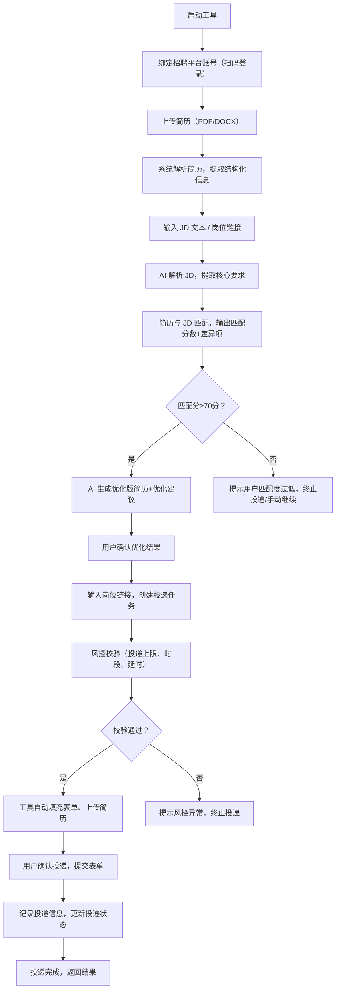
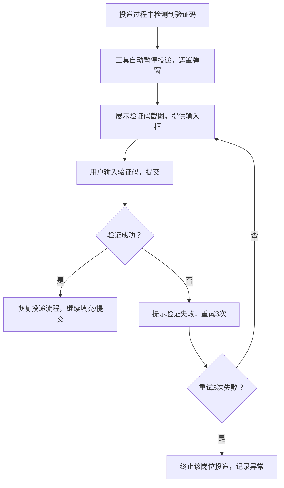
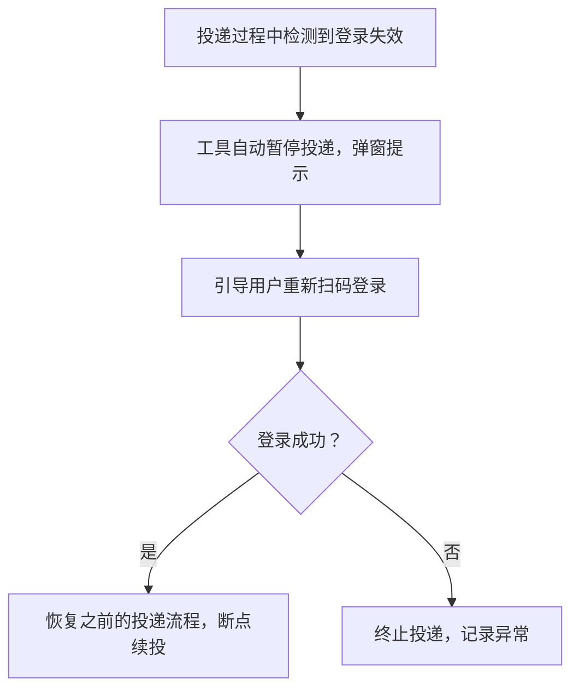
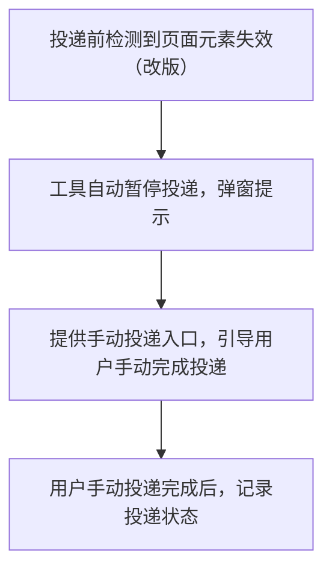

# AI 求职智能管家（AI Job Agent）
## 产品需求文档（PRD）V1.0
**文档编号**：AI-JOB-AGENT-PRD-V1.0  
**文档版本**：V1.0  
**编制部门**：产品部  
**编制日期**：2026-04-04  
**适用范围**：产品立项、研发实施、测试验收、运营推广  
**关联文档**：《技术设计文档V1.0》《UI设计规范V1.0》《环境搭建规范V1.0》  

## 目录
1.  文档概述
2.  产品基本信息
3.  用户需求分析
4.  产品定位与核心价值
5.  核心业务流程
6.  详细功能需求（按模块）
7.  交互需求
8.  非功能需求
9.  合规与免责需求
10. 验收标准
11. 迭代规划
12. 版本管理
13. 附录

---

## 1. 文档概述
### 1.1 文档目的
本文档明确「AI求职智能管家」的**产品需求、功能边界、交互逻辑、验收标准**，作为研发、测试、设计、运营的统一执行依据，确保产品落地符合用户需求、商务规范及技术可行性，同时明确产品核心差异化优势，规避开源脚本的痛点，打造安全、智能、可控的求职辅助工具。

### 1.2 文档范围
覆盖产品全功能模块（简历管理、JD解析、AI优化、自动化投递、风控异常、数据统计、系统设置），明确各模块的功能细节、操作流程、业务规则，不包含具体技术实现细节（详见《技术设计文档》），不包含商业化推广策略（另行编制）。

### 1.3 术语定义
| 术语 | 定义 |
|------|------|
| AI 求职智能管家 | 本文档所描述的核心产品，基于多智能体（LangGraph）的求职辅助工具，提供简历解析、JD匹配、AI优化、安全投递等一站式服务 |
| 多智能体（Agent） | 产品核心执行单元，分工负责简历解析、JD匹配、投递等单一业务，由LangGraph编排协同 |
| 半自动投递 | 工具自动完成表单填充、简历上传，需人工确认后提交，禁止全自动无确认投递 |
| 风控限流 | 模拟真人行为，通过投递频率、时段控制，降低招聘平台账号风控/封号风险 |
| 本地存储 | 所有用户数据（简历、Cookie、投递记录）仅存储在用户本地设备，不上传云端服务器 |
| JD | 岗位描述（Job Description），包含岗位要求、技能需求、工作年限等信息 |
| MVP | 最小可行版本，V1.0版本实现核心功能，满足用户基础求职需求 |

### 1.4 前提与约束
1.  产品仅支持 PC 端（Windows 10+/macOS 12+），基于 Anaconda3 环境运行，不支持移动端；
2.  首期仅支持 BOSS 直聘平台，后续迭代扩展至智联、猎聘；
3.  不涉及云端数据同步、用户注册登录（仅本地设备使用）；
4.  严格遵循招聘平台用户协议，不提供恶意投递、代投等违规功能；
5.  所有功能需兼容 Python 3.11 及指定依赖版本（详见《环境搭建规范》）。

---

## 2. 产品基本信息
| 项目 | 详情 |
|------|------|
| 产品名称 | AI 求职智能管家 |
| 产品版本 | V1.0（MVP） |
| 产品定位 | 企业级、合规化、本地化的 AI 多智能体求职辅助工具，面向个人求职者，提供「解析-匹配-优化-投递-统计」全流程服务 |
| 核心价值 | 1. 安全合规：模拟真人行为，规避账号封号风险；2. 智能高效：AI 优化简历、精准匹配 JD，提升面试通过率；3. 全流程可控：人工确认机制，杜绝误投；4. 隐私安全：数据本地存储，杜绝简历泄露 |
| 目标用户 | 1. 核心用户：互联网/IT 行业求职者（后端、前端、测试、产品、运营等）；2. 次要用户：追求求职效率、担心账号安全的职场人；3. 潜在用户：有技术基础、需要自用求职工具的开发人员 |
| 交互模式 | PC 端客户端（PyInstaller 打包）+ 简约商务 UI，支持鼠标、键盘操作，无需编程基础即可使用 |
| 收费模式 | 免费（V1.0 版本），后续迭代可新增增值功能（付费解锁） |

---

## 3. 用户需求分析
### 3.1 用户画像
| 用户类型 | 核心特征 | 核心需求 | 痛点 |
|----------|----------|----------|------|
| 职场新人 | 缺乏求职经验，简历优化能力弱，投递效率低 | 快速优化简历、匹配合适岗位、安全投递 | 简历无针对性、投递易封号、不知如何优化 |
| 职场老人 | 有工作经验，需精准匹配岗位，节省投递时间 | 高效批量投递、精准匹配 JD、跟踪投递进度 | 手动投递繁琐、简历与 JD 匹配度低、担心隐私泄露 |
| 技术求职者 | 有一定技术基础，熟悉工具使用，注重账号安全 | 合规投递、自定义风控参数、本地数据存储 | 开源脚本易封号、简历易泄露、流程不可控 |

### 3.2 核心用户痛点
1.  效率痛点：手动投递简历繁琐，单日可投递量有限，耗时耗力；
2.  效果痛点：简历与 JD 匹配度低，投递后无反馈，面试率低；
3.  安全痛点：开源脚本无风控，易触发平台风控导致账号封号；
4.  隐私痛点：部分工具将简历、账号信息上传云端，存在泄露风险；
5.  可控痛点：全自动投递易误投垃圾公司、骗子公司，无法掌控投递过程；
6.  异常痛点：投递过程中遇到验证码、登录失效、页面改版，工具直接崩溃，无法继续。

### 3.3 用户场景
#### 场景1：简历优化与匹配
用户上传个人简历（PDF/DOCX），粘贴目标岗位 JD，工具自动解析简历与 JD，输出匹配度分数及差异项，生成 AI 优化版简历，用户查看优化建议后，确认优化结果。

#### 场景2：安全半自动投递
用户选择优化后的简历，输入岗位链接，工具自动检测账号状态、执行风控校验，自动填充表单、上传简历，弹出确认窗口，用户确认后完成投递，工具记录投递信息。

#### 场景3：异常处理
投递过程中遇到验证码，工具自动暂停，展示验证码截图，用户输入验证码后继续投递；遇到登录失效，工具引导用户重新扫码登录，登录后断点续投。

#### 场景4：投递进度跟踪
用户查看历史投递记录，筛选不同状态（已投递、待确认、异常、已撤回）的投递任务，查看投递时间、匹配分数，导出投递统计报表，进行求职复盘。

#### 场景5：系统配置
用户根据自身需求，调整投递风控参数（每日最大投递量、投递延时、投递时段），配置大模型 API 密钥，清理本地数据，查看用户协议与免责声明。

---

## 4. 产品定位与核心价值
### 4.1 产品定位
**个人级 AI 求职管家，合规、智能、可控的求职辅助工具**  
区别于开源暴力投递脚本，聚焦「安全投递+AI 优化」双核心，以本地化存储、人工可控、异常自愈为差异化优势，打造适合个人求职者的企业级工具，不追求“批量暴力投递”，而是追求“精准高效投递”，提升面试通过率。

### 4.2 核心价值
| 价值点 | 具体描述 | 解决的用户痛点 |
|--------|----------|----------------|
| 安全合规 | 模拟真人行为（随机延时、时段控制、行为模拟），杜绝暴力投递，降低账号封号风险 | 开源脚本易封号、平台风控拦截 |
| 智能高效 | AI 解析简历与 JD，精准匹配打分，自动优化简历，植入岗位关键词，提升面试通过率 | 简历与 JD 匹配度低、优化能力弱、投递效率低 |
| 全流程可控 | 投递前二次确认，支持筛选岗位、设置黑名单，杜绝误投，用户掌控投递全过程 | 全自动投递易误投、无法掌控投递流程 |
| 隐私安全 | 所有数据（简历、Cookie、投递记录）仅本地存储，AES 加密，不上传云端 | 简历泄露、账号信息泄露 |
| 异常自愈 | 自动处理验证码、登录失效、页面改版等异常，提供兜底方案，保障流程不中断 | 工具崩溃、异常无法处理、投递中断 |
| 易用便捷 | 简约商务 UI，无需编程基础，3 步即可完成核心投递流程，小白也能快速上手 | 开源脚本需编程基础、操作复杂 |

### 4.3 差异化优势（对比开源脚本）
| 对比维度 | 开源投递脚本 | 本产品 |
|----------|--------------|--------|
| 风控能力 | 无风控，暴力投递，易封号 | 有完善风控（延时、时段、上限），模拟真人，不易封号 |
| 简历优化 | 无优化功能，仅自动点击 | AI 精准优化，贴合 JD，提升面试率 |
| 可控性 | 全自动无确认，易误投 | 人工二次确认，可筛选、可取消，杜绝误投 |
| 隐私保护 | 部分上传云端，存在泄露风险 | 纯本地存储，加密保护，无泄露风险 |
| 异常处理 | 遇到异常直接崩溃，无兜底 | 自动暂停、引导人工介入，提供兜底方案 |
| 易用性 | 命令行操作，需编程基础 | 可视化 UI，小白可直接使用 |
| 可维护性 | 无规范，难以维护、迭代 | 企业级架构，可维护、可扩展、可迭代 |

---

## 5. 核心业务流程
### 5.1 主业务流程（标准投递流程）

### 5.2 异常分支流程
#### 分支1：验证码异常

#### 分支2：登录失效异常

#### 分支3：页面改版异常

---

## 6. 详细功能需求（按模块）
### 6.1 模块1：工作台（首页 Dashboard）
#### 6.1.1 功能概述
作为产品入口，展示核心数据概览、快捷操作入口、最近投递记录，方便用户快速启动核心流程，查看关键信息。

#### 6.1.2 具体功能
| 功能点 | 功能描述 | 操作流程 | 业务规则 |
|--------|----------|----------|----------|
| 数据概览卡片 | 展示4个核心数据：今日可投递额度、今日已投递数、累计投递数、平均匹配分 | 无需操作，页面加载后自动展示 | 1. 今日可投递额度默认20，可在系统设置中修改；2. 平均匹配分取近7日投递任务的平均分；3. 数据实时更新 |
| 账号状态提示 | 展示当前绑定的招聘平台账号状态（正常/异常），异常时提示原因 | 无需操作，页面加载后自动检测展示 | 1. 自动检测 Cookie 有效性，判断账号状态；2. 账号异常时，提供申诉指引链接 |
| 快捷操作区 | 3个核心快捷入口：上传简历、新建投递任务、查看投递记录 | 点击对应入口，跳转至对应页面 | 快捷入口固定展示，不可隐藏 |
| 最近投递记录 | 展示近5条投递记录，包含：公司、岗位、匹配分、投递时间、状态 | 点击记录，跳转至投递详情页；支持点击“查看全部”跳转至投递记录页 | 按投递时间倒序排列，仅展示近5条 |
| 风险提示条 | 展示当前风控状态、投递时段提示，异常时展示风险警告 | 无需操作，页面加载后自动展示 | 1. 非投递时段（9:00-18:00）提示“当前非投递时段，建议在9:00-18:00投递”；2. 今日投递量达上限时，提示“今日投递已达上限，明日解锁” |

### 6.2 模块2：简历管理
#### 6.2.1 功能概述
实现简历的上传、解析、版本管理、预览、导出、删除，支持原始简历与优化简历的区分管理，确保简历数据本地存储、安全可控。

#### 6.2.2 具体功能
| 功能点 | 功能描述 | 操作流程 | 业务规则 |
|--------|----------|----------|----------|
| 简历上传 | 支持上传 PDF、DOCX 格式简历，单文件大小≤10MB | 点击“上传简历”按钮，选择本地文件，确认上传 | 1. 仅支持 PDF、DOCX 格式；2. 上传后自动保存至本地指定目录；3. 重复上传同名文件时，提示“文件已存在，是否覆盖” |
| 简历解析 | 上传简历后，自动解析简历内容，提取结构化信息（个人信息、技能、工作经历、项目经历、学历） | 上传简历后，系统自动触发解析，解析完成后提示“解析成功” | 1. 解析时间≤3s；2. 解析失败时，提示“解析失败，请检查文件格式或重新上传”；3. 解析结果可手动编辑修正 |
| 简历预览 | 支持预览原始简历、解析后的结构化简历、AI 优化后的简历 | 点击“预览”按钮，弹出预览弹窗，支持切换“原始简历”“解析版”“优化版” | 预览弹窗支持放大、缩小、关闭操作 |
| 简历版本管理 | 保存原始简历及所有 AI 优化版本，标记版本创建时间、优化场景 | 每次生成优化简历后，自动创建新版本，展示在版本列表中 | 1. 最多保存10个版本；2. 可设置某版本为“默认版本”；3. 版本可删除（原始版本不可删除） |
| 简历导出 | 支持导出原始简历、优化后的简历（PDF 格式） | 点击“导出”按钮，选择导出版本，选择保存路径，确认导出 | 导出文件命名格式：姓名-简历版本-日期.pdf |
| 简历删除 | 支持删除非原始版本的简历，删除前二次确认 | 点击“删除”按钮，弹出确认弹窗，点击“确认”完成删除 | 1. 原始简历不可删除；2. 删除后不可恢复；3. 若该简历关联投递任务，删除后不影响已有的投递记录 |
| 简历加密存储 | 所有简历文件及解析数据本地加密存储（AES 加密） | 无需手动操作，系统自动加密 | 1. 加密密钥本地存储；2. 仅工具可读取加密数据；3. 支持设置解锁密码，打开工具时需输入密码 |

### 6.3 模块3：JD 解析与岗位匹配
#### 6.3.1 功能概述
实现 JD 文本/岗位链接的解析，提取核心岗位要求，与简历进行智能匹配，输出匹配分数及差异项，为简历优化和投递提供依据。

#### 6.3.2 具体功能
| 功能点 | 功能描述 | 操作流程 | 业务规则 |
|--------|----------|----------|----------|
| JD 输入 | 支持两种输入方式：1. 手动粘贴 JD 文本；2. 输入岗位链接（V1.0 暂不支持，V1.1 迭代） | 选择输入方式，粘贴文本/输入链接，点击“解析 JD” | 1. JD 文本长度≥100字；2. 岗位链接仅支持 BOSS 直聘链接（V1.1）；3. 输入为空时，提示“请输入 JD 文本或岗位链接” |
| JD 解析 | 自动解析 JD 内容，提取核心信息：岗位名称、技能要求、工作年限、学历要求、岗位职责、关键词 | 点击“解析 JD”后，系统自动解析，解析完成后展示结构化结果 | 1. 解析时间≤5s；2. 解析失败时，提示“解析失败，请检查 JD 文本或链接” |
| 简历选择 | 支持从已上传的简历中选择需要匹配的简历 | 点击“选择简历”下拉框，选择目标简历 | 1. 若未上传简历，提示“请先上传简历”；2. 可选择任意已解析成功的简历 |
| 智能匹配 | 基于简历结构化数据与 JD 核心要求，进行关键词匹配+语义匹配，输出 0-100 分的匹配分数 | 选择简历后，点击“开始匹配”，系统自动计算匹配分数 | 1. 匹配权重：关键词60%、工作年限20%、学历20%；2. 匹配分数≥85分为“高匹配”，60-84分为“一般匹配”，<60分为“低匹配” |
| 匹配差异展示 | 展示简历与 JD 的匹配项、缺失项、薄弱项，明确告知用户简历需优化的地方 | 匹配完成后，自动展示差异结果，分“匹配项”“缺失项”“薄弱项”三类 | 1. 缺失项：JD 要求但简历中未提及的内容；2. 薄弱项：简历中提及但不符合 JD 要求的内容 |
| 匹配结果保存 | 自动保存匹配记录，包含：简历名称、JD 内容、匹配分数、差异项 | 匹配完成后，系统自动保存，可在“匹配记录”中查看 | 匹配记录可删除，删除前二次确认 |
| 匹配阈值设置 | 支持用户自定义匹配阈值（默认70分），低于阈值时，提示用户是否继续投递 | 点击“阈值设置”，输入0-100之间的数值，确认保存 | 阈值设置后，全局生效，所有投递任务均按该阈值判断 |

### 6.4 模块4：AI 简历优化
#### 6.4.1 功能概述
基于 JD 核心要求，AI 自动优化简历，植入岗位关键词，量化工作成果，提供优化建议，生成优化版简历，同时支持求职信生成，提升简历与 JD 的匹配度和面试通过率。

#### 6.4.2 具体功能
| 功能点 | 功能描述 | 操作流程 | 业务规则 |
|--------|----------|----------|----------|
| 一键优化 | 基于匹配后的 JD 要求，AI 自动优化简历，生成优化版简历 | 匹配完成后，点击“一键优化”，系统自动生成优化简历 | 1. 优化时间≤10s；2. 优化失败时，提示“优化失败，请检查 JD 解析结果或重新上传简历”；3. 优化后自动创建简历新版本 |
| 优化对比 | 双栏对比展示原始简历片段与优化后简历片段，清晰呈现优化点 | 优化完成后，自动展示对比界面，支持切换“全部对比”“技能对比”“工作经历对比” | 对比界面支持滚动、放大，可查看详细优化细节 |
| 优化建议 | 输出至少3条可执行的优化建议，包含：优化点、优化原因、优化示例 | 优化完成后，自动展示优化建议列表，按优先级排序 | 优化建议可复制，支持手动修改优化后的简历 |
| 简历编辑 | 支持手动编辑优化后的简历，修改内容后保存 | 点击“编辑”按钮，进入编辑界面，修改完成后点击“保存” | 1. 编辑界面支持基本格式调整（字体、行距、加粗）；2. 保存后自动更新简历版本 |
| 求职信生成 | 基于优化后的简历和 JD 要求，自动生成简短求职信（100-150字） | 点击“生成求职信”，系统自动生成，支持手动编辑 | 1. 求职信包含：个人优势、岗位匹配度、求职意愿；2. 生成后可复制、导出 |
| 优化版本保存 | 每次优化后，自动保存为新的简历版本，标记优化时间、对应 JD | 优化完成后，系统自动保存，可在简历管理的版本列表中查看 | 同一份简历的优化版本最多保存10个 |

### 6.5 模块5：自动化投递
#### 6.5.1 功能概述
实现 BOSS 直聘平台的半自动投递，支持批量投递任务创建、表单自动填充、人工确认提交，结合风控限流机制，模拟真人行为，确保投递安全、可控。

#### 6.5.2 具体功能
| 功能点 | 功能描述 | 操作流程 | 业务规则 |
|--------|----------|----------|----------|
| 投递任务创建 | 支持创建单个/批量投递任务，输入岗位链接，选择优化后的简历 | 1. 单个投递：输入岗位链接，选择简历，点击“创建任务”；2. 批量投递：导入岗位链接列表（TXT/Excel），选择简历，点击“创建批量任务” | 1. 批量投递最多支持20个岗位/次；2. 岗位链接仅支持 BOSS 直聘；3. 未选择简历时，提示“请选择优化后的简历” |
| 投递前确认 | 投递前弹出确认窗口，展示：公司名称、岗位名称、匹配分数、简历预览，用户确认后才开始投递 | 创建任务后，自动弹出确认窗口，用户点击“确认投递”，启动投递流程 | 1. 强制确认，不可跳过；2. 可点击“取消”终止投递任务；3. 批量投递时，先展示所有待投递岗位列表，勾选确认后启动 |
| 风控校验 | 投递前自动校验：今日投递量是否达上限、当前是否在投递时段、投递间隔是否符合要求 | 确认投递后，系统自动执行风控校验 | 1. 投递时段默认9:00-18:00，可自定义；2. 单日投递量默认20，可自定义；3. 投递间隔2-4秒随机延时；4. 校验失败时，提示失败原因，终止投递 |
| 表单自动填充 | 自动填充岗位投递表单，包含：姓名、电话、工作经历、技能、学历，自动上传选择的优化简历 | 风控校验通过后，工具自动启动浏览器，打开岗位页面，填充表单、上传简历 | 1. 表单填充时间≤30s；2. 填充失败时，提示“表单填充失败，请手动填充”；3. 支持手动修正填充内容 |
| 人工提交确认 | 表单填充完成后，提示用户“表单已填充，请确认提交”，用户手动点击平台“投递”按钮完成提交 | 表单填充完成后，弹出提示，用户在浏览器中点击“投递”按钮，完成后返回工具确认 | 1. 强制人工提交，不可自动点击；2. 用户点击提交后，工具自动记录投递状态为“已投递” |
| 投递进度展示 | 实时展示投递进度：正在打开页面、正在填充表单、等待人工提交、投递完成 | 投递过程中，工具界面实时更新进度提示 | 进度提示清晰易懂，避免用户误操作 |
| 投递中断与恢复 | 支持投递过程中手动中断，中断后可重新启动，从中断的岗位继续投递 | 点击“中断投递”，弹出确认窗口，确认后终止投递；点击“恢复投递”，从上次中断的岗位继续 | 1. 中断后，已投递的岗位记录为“已投递”，未投递的为“待投递”；2. 工具关闭后重启，可恢复未完成的投递任务 |

### 6.6 模块6：投递记录与数据统计
#### 6.6.1 功能概述
记录所有投递任务的详细信息，支持筛选、排序、查看详情，提供投递数据统计图表，方便用户跟踪投递进度、复盘求职情况。

#### 6.6.2 具体功能
| 功能点 | 功能描述 | 操作流程 | 业务规则 |
|--------|----------|----------|----------|
| 投递记录列表 | 展示所有投递记录，包含：序号、公司名称、岗位名称、岗位链接、匹配分数、投递时间、投递状态、操作 | 进入投递记录页，自动加载所有记录 | 1. 按投递时间倒序排列；2. 支持分页（每页10条）；3. 记录永久保存，可手动删除 |
| 投递状态标记 | 支持标记投递状态：待投递、已投递、误投、已撤回、无反馈、面试邀请 | 点击状态下拉框，选择对应状态，确认保存 | 1. 初始状态为“待投递”“已投递”“异常”；2. 状态修改后，实时更新；3. 可按状态筛选记录 |
| 筛选功能 | 支持多条件筛选：时间范围（今日/近7日/近30日/自定义）、投递状态、匹配分数范围、平台 | 选择筛选条件，点击“筛选”，列表展示符合条件的记录 | 1. 筛选条件可组合使用；2. 点击“重置”，恢复默认筛选状态 |
| 排序功能 | 支持按投递时间、匹配分数、公司名称排序（升序/降序） | 点击列表表头（投递时间/匹配分数/公司名称），切换排序方式 | 默认按投递时间降序排列 |
| 投递详情查看 | 点击投递记录，查看详情：简历信息、JD 信息、匹配差异、投递时间、状态变更记录 | 点击记录行，弹出详情抽屉，展示详细信息 | 详情抽屉支持关闭，不可编辑 |
| 数据统计图表 | 展示2类图表：1. 近7日投递量趋势图；2. 匹配分分布饼图 | 进入投递记录页，自动加载图表，支持切换图表类型 | 1. 图表实时更新；2. 支持鼠标悬浮查看具体数据；3. 无投递记录时，提示“暂无投递数据” |
| 数据导出 | 支持导出投递记录为 Excel 报表，包含所有记录字段 | 点击“导出”按钮，选择保存路径，确认导出 | 导出文件命名格式：投递记录-日期.xlsx |
| 记录删除 | 支持手动删除投递记录，删除前二次确认 | 点击“删除”按钮，弹出确认弹窗，点击“确认”完成删除 | 删除后不可恢复，删除时不影响简历数据 |

### 6.7 模块7：系统设置
#### 6.7.1 功能概述
实现产品的全局配置，包括账号管理、风控设置、大模型 API 配置、数据隐私设置、用户协议查看，确保产品适配用户个性化需求，同时明确责任边界。

#### 6.7.2 具体功能
| 功能点 | 功能描述 | 操作流程 | 业务规则 |
|--------|----------|----------|----------|
| 账号管理 | 展示当前绑定的招聘平台账号，支持退出登录、重新登录 | 点击“退出登录”，弹出确认弹窗，确认后清除本地 Cookie；点击“重新登录”，引导扫码登录 | 1. 退出登录后，所有投递任务暂停；2. 重新登录后，可恢复投递任务；3. 仅支持绑定1个平台账号（V1.0） |
| 投递风控设置 | 支持自定义风控参数：1. 每日最大投递量（1-50）；2. 投递延时（1-10秒）；3. 投递时段（自定义） | 输入参数值，点击“保存设置”，弹出保存成功提示 | 1. 每日最大投递量默认20，不可超过50；2. 投递延时默认2-4秒，可自定义范围1-10秒；3. 投递时段默认9:00-18:00，可自定义；4. 保存后立即生效 |
| 大模型 API 配置 | 支持配置大模型 API 密钥、基础 URL，支持切换大模型（通义千问/GPT） | 输入 API 密钥、基础 URL，选择大模型，点击“保存配置” | 1. API 密钥加密本地存储；2. 配置错误时，提示“API 配置错误，请检查密钥和 URL”；3. 未配置 API 时，无法使用 AI 优化、JD 匹配功能 |
| 数据与隐私设置 | 1. 一键清理本地数据（简历、投递记录、Cookie）；2. 设置简历加密密码；3. 开启/关闭数据自动备份 | 点击“清理数据”，弹出三次确认弹窗；输入加密密码，点击“设置密码”；勾选“自动备份”，点击“保存” | 1. 清理数据后，所有本地数据不可恢复；2. 加密密码设置后，每次打开工具需输入密码；3. 自动备份默认关闭，开启后每日备份一次数据 |
| 用户协议与免责声明 | 展示《用户使用须知》《免责声明》，明确产品用途、责任边界 | 点击“用户协议”“免责声明”，弹出弹窗查看文本 | 1. 首次使用工具时，强制弹窗展示用户协议，需勾选“已阅读并同意”才能继续使用；2. 协议内容不可编辑，可复制 |
| 版本信息 | 展示产品版本号、更新日志、联系方式 | 进入系统设置页，自动展示版本信息 | 1. 支持点击“检查更新”，查看是否有新版本；2. V1.0 版本暂不支持自动更新，需手动下载更新 |

### 6.8 模块8：异常与风控交互
#### 6.8.1 功能概述
处理投递过程中的各类异常（验证码、登录失效、页面改版、风控触发），提供清晰的提示和解决方案，确保流程可恢复、用户可操作，降低用户损失。

#### 6.8.2 具体功能
| 功能点 | 功能描述 | 操作流程 | 业务规则 |
|--------|----------|----------|----------|
| 验证码处理 | 检测到验证码（滑块/图文/短信）时，自动暂停投递，展示验证码截图和输入框，用户输入后继续投递 | 工具检测到验证码后，自动弹窗，用户输入验证码，点击“提交” | 1. 支持3次验证机会；2. 3次验证失败，终止该岗位投递，记录异常；3. 验证码截图自动保存至本地日志目录 |
| 登录失效处理 | 检测到登录失效（Cookie 过期、平台强制退出）时，自动暂停投递，引导用户重新扫码登录 | 工具检测到登录失效后，弹窗提示，用户点击“重新登录”，扫码完成登录 | 1. 登录成功后，自动恢复之前的投递流程（断点续投）；2. 登录失败，终止投递，记录异常；3. 7天无操作，自动清除 Cookie，需重新登录 |
| 页面改版处理 | 检测到页面元素失效（平台改版）时，自动暂停投递，提示页面结构更新，提供手动投递入口 | 工具检测到元素匹配失败后，弹窗提示，用户点击“手动投递”，跳转至岗位页面手动投递 | 1. 记录页面结构变化日志，供后续脚本适配；2. 手动投递完成后，用户可在工具中标记“已投递”，更新记录状态 |
| 风控触发处理 | 检测到平台风控提示（操作频繁、账号异常）时，立即暂停投递，给出人工处理指引 | 工具检测到风控关键词后，弹窗提示，展示处理步骤（退出账号→清除 Cookie→更换网络→重新登录） | 1. 风控触发后，当日禁止继续投递；2. 提供招聘平台官方申诉入口链接；3. 记录风控触发日志，供用户排查原因 |
| 异常日志记录 | 自动记录所有异常（验证码、登录失效、页面改版、风控），包含：异常码、异常信息、异常时间、截图 | 异常发生时，系统自动记录，可在“异常日志”中查看 | 1. 异常日志本地存储，可导出；2. 日志保留30天，超过30天自动清理；3. 支持手动删除日志 |

---

## 7. 交互需求
### 7.1 整体交互原则
1.  简洁高效：核心操作步骤≤3步，避免冗余交互，符合商务工具的易用性要求；
2.  可预期性：所有操作都有明确反馈，加载状态有骨架屏，异常状态有清晰提示；
3.  强确认：高危操作（删除、清理数据、投递确认）必须二次确认，避免误操作；
4.  一致性：所有页面导航结构、按钮样式、弹窗样式保持统一，符合商务 UI 规范；
5.  可回溯：所有操作记录（投递、优化、删除）可查看，支持回溯操作历史；
6.  容错性：用户输入错误、操作失误时，有提示并可挽回（如删除前确认、编辑可撤销）。

### 7.2 页面导航交互
1.  全局导航：左侧固定导航栏，包含所有核心模块（工作台、简历管理、JD 匹配、简历优化、投递任务、投递记录、系统设置），点击导航项跳转至对应页面；
2.  面包屑导航：每个页面顶部展示面包屑，显示当前页面位置，支持点击面包屑返回上一级页面；
3.  页面切换：页面切换时，有轻微过渡动画，避免生硬跳转；
4.  返回操作：每个页面支持“返回”按钮，返回上一级页面，不丢失当前页面输入内容。

### 7.3 表单与按钮交互
1.  表单交互：
    - 输入框聚焦时，边框变为主色（#165DFF），有提示文字；
    - 输入错误时，边框变为危险红（#F53F3F），下方显示错误提示；
    - 下拉框点击展开，支持搜索筛选，选择后自动收起；
    - 表单提交时，按钮变为加载状态，禁止重复点击。
2.  按钮交互：
    - 主按钮（#165DFF）： hover 时加深颜色，点击时有按压反馈；
    - 次按钮（灰边白底）： hover 时背景变浅灰，点击时有反馈；
    - 文字按钮： hover 时文字颜色加深，无背景反馈；
    - 禁用按钮：透明度 0.5，不可点击，鼠标悬浮时提示禁用原因。

### 7.4 弹窗与抽屉交互
1.  弹窗：
    - 所有弹窗居中展示，遮罩层半透明（rgba(0,0,0,0.3)）；
    - 弹窗标题清晰，内容简洁，底部有明确的操作按钮（确认/取消）；
    - 可点击遮罩层或“关闭”按钮关闭弹窗；
    - 高危操作弹窗（删除、清理数据），按钮间距加大，确认按钮为危险红。
2.  抽屉：
    - 所有抽屉从右侧滑出，宽度 400px；
    - 抽屉顶部有关闭按钮，底部有操作按钮；
    - 抽屉内容可滚动，适配长文本展示；
    - 点击遮罩层可关闭抽屉。

### 7.5 加载与反馈交互
1.  加载状态：
    - 页面加载时，使用骨架屏展示占位内容，避免空白；
    - 按钮加载时，显示加载动画（圆形旋转），禁止点击；
    - 数据加载时，显示“加载中...”提示，加载完成后自动隐藏。
2.  操作反馈：
    - 操作成功时，顶部显示绿色提示条（含成功图标），3秒后自动消失；
    - 操作失败时，顶部显示红色提示条（含失败图标），5秒后自动消失，可点击“重试”；
    - 提示信息简洁明了，不超过20字，避免冗余。

### 7.6 异常交互
1.  验证码弹窗：遮罩层覆盖整个页面，弹窗居中，展示验证码截图、输入框、提交/取消按钮，输入后实时校验；
2.  登录失效弹窗：居中弹窗，展示登录失效提示、重新登录按钮，点击后跳转至扫码登录界面；
3.  风控提示：顶部红色提示条，展示风控原因和处理指引，点击“查看详情”可查看完整处理步骤；
4.  页面改版提示：居中弹窗，展示改版提示、手动投递按钮，点击后跳转至岗位页面。

---

## 8. 非功能需求
### 8.1 性能需求
1.  响应速度：
    - 页面加载时间≤1.5s；
    - 简历解析时间≤3s；
    - JD 解析+匹配时间≤5s；
    - AI 简历优化时间≤10s；
    - 单岗位投递流程（含人工确认）≤60s；
    - 数据查询（投递记录、匹配记录）≤1s。
2.  稳定性：
    - 连续运行24小时无崩溃；
    - 投递过程中遇到异常，不崩溃，可正常暂停、恢复；
    - 多任务并行（最多5个投递任务）时，无卡顿、无冲突；
    - 浏览器自动化操作成功率≥90%。
3.  资源占用：
    - 内存占用≤500MB；
    - CPU 占用≤30%（单线程）；
    - 本地存储占用≤100MB（不含简历文件）。

### 8.2 安全需求
1.  数据安全：
    - 所有用户数据（简历、Cookie、API 密钥、投递记录）仅本地存储，不上传任何云端服务器；
    - 简历文件、Cookie、API 密钥采用 AES 加密存储，仅工具可读取；
    - 支持一键清理所有本地数据，清理后不可恢复；
    - 禁止日志中记录敏感信息（如完整简历内容、API 密钥明文）。
2.  账号安全：
    - 不保存用户招聘平台账号密码，仅保存 Cookie（加密）；
    - 7天无操作自动清除 Cookie，需重新登录；
    - 检测到异常登录行为（如异地登录、多次登录失败），提示用户检查账号安全；
    - 禁止恶意模拟登录、批量注册账号。
3.  代码安全：
    - 代码无恶意逻辑，不窃取用户数据、不植入广告；
    - 依赖库使用官方稳定版本，避免漏洞；
    - 打包后的客户端无恶意插件、无捆绑安装。

### 8.3 合规需求
1.  行为合规：
    - 仅模拟人工正常求职行为，不进行暴力投递、恶意爬取；
    - 严格遵循招聘平台用户协议，不违反平台规则；
    - 禁止用于商业代投、批量恶意投递，一经发现，锁定工具功能。
2.  责任合规：
    - 明确用户责任：用户需遵守招聘平台规则，账号封号、信息泄露等风险由用户自行承担；
    - 明确产品边界：产品仅为辅助工具，不保证投递成功、不保证账号不被风控；
    - 强制展示用户协议与免责声明，首次使用需勾选同意才能继续。
3.  隐私合规：
    - 不收集、不存储、不上传用户个人敏感信息（除本地使用外）；
    - 不共享用户数据给任何第三方；
    - 支持用户自主控制数据（删除、加密、备份）。

### 8.4 兼容性需求
1.  系统兼容性：
    - Windows：Windows 10 及以上版本（32位/64位）；
    - macOS：macOS 12 及以上版本。
2.  环境兼容性：
    - 支持 Anaconda3 环境，Python 3.11 版本；
    - 支持 Chrome 最新版本（Playwright 适配版本）；
    - 兼容指定依赖版本（详见《环境搭建规范》）。
3.  分辨率兼容性：
    - 支持 PC 端分辨率 1920×1080 及以上；
    - 支持 1200px 居中布局，适配不同屏幕尺寸；
    - 禁止横向滚动，纵向滚动流畅。

### 8.5 易用性需求
1.  操作门槛：无需编程基础，小白用户可在5分钟内上手核心流程；
2.  提示清晰：所有操作都有明确提示，异常状态有详细处理指引；
3.  容错性：用户操作失误（如输入错误、误点击）可挽回，有二次确认；
4.  文档支持：内置简单使用指南，点击“帮助”可查看操作步骤；
5.  界面简洁：商务简约风格，无冗余视觉元素，重点功能突出。

---

## 9. 合规与免责需求
### 9.1 合规要求
1.  产品用途限制：
    - 本产品仅用于个人合法求职，禁止用于商业代投、批量恶意投递、违规爬取等行为；
    - 禁止使用本产品投递虚假简历、虚假信息，禁止投递违规岗位（如诈骗、违法岗位）；
    - 禁止修改工具风控参数，用于暴力投递，否则后果自负。
2.  平台规则遵循：
    - 用户需严格遵守招聘平台（BOSS 直聘等）的用户协议，不得违反平台规定；
    - 因用户违反平台规则导致的账号封号、限制等问题，产品不承担任何责任；
    - 平台页面改版、策略调整导致产品功能失效，属正常现象，产品将逐步适配。

### 9.2 免责声明（必须显著展示）
1.  本产品仅为个人求职辅助工具，不代表任何招聘平台官方，不承诺投递成功、不承诺账号不被风控；
2.  因用户操作不当、违反平台规则、平台策略调整等原因导致的任何损失（如账号封号、信息泄露），本产品不承担任何责任；
3.  本产品仅提供技术辅助，不保证简历优化效果、投递成功率，求职结果最终由用户自身条件和招聘方决定；
4.  用户需自行保管个人简历、账号信息，因用户自身泄露导致的风险，本产品不承担责任；
5.  本产品仅本地存储用户数据，不保证数据绝对安全，用户需定期备份数据，因设备故障、误操作导致的数据丢失，本产品不承担责任。

### 9.3 展示要求
1.  首次使用产品时，强制弹窗展示《用户使用须知》《免责声明》，用户必须勾选“已阅读并同意”才能继续使用；
2.  系统设置页，永久展示“用户协议”“免责声明”入口，用户可随时查看；
3.  投递页面、账号管理页面，显著位置展示风险提示（如“账号安全由用户自行负责”“禁止暴力投递”）；
4.  免责声明文本清晰、无歧义，字体大小≥12px，颜色为文字三级色（#86909C），但需确保可阅读。

---

## 10. 验收标准（MVP V1.0）
### 10.1 功能验收标准
| 模块 | 验收条件 |
|------|----------|
| 工作台 | 1. 数据概览卡片正常展示，数据实时更新；2. 快捷入口可正常跳转；3. 最近投递记录正常展示，可点击查看详情；4. 风险提示条正常展示，符合业务规则 |
| 简历管理 | 1. 可正常上传 PDF/DOCX 简历（≤10MB）；2. 简历解析成功，结构化信息提取准确；3. 可正常预览、导出、删除简历；4. 简历版本管理正常，优化后自动创建新版本；5. 简历加密存储正常 |
| JD 解析与匹配 | 1. 可正常输入 JD 文本，解析成功；2. 可选择简历进行匹配，匹配分数计算准确；3. 匹配差异项展示清晰，符合业务规则；4. 可自定义匹配阈值，阈值生效正常 |
| AI 简历优化 | 1. 可一键生成优化版简历，优化时间≤10s；2. 双栏对比正常展示，优化点清晰；3. 可生成求职信，可手动编辑优化简历；4. 优化版本保存正常 |
| 自动化投递 | 1. 可创建单个/批量投递任务，岗位链接有效；2. 投递前确认正常，强制人工确认；3. 风控校验正常，符合投递上限、时段、延时规则；4. 表单自动填充正常，可手动修正；5. 人工提交确认正常，投递记录更新正常 |
| 投递记录与统计 | 1. 投递记录正常展示，包含所有字段；2. 筛选、排序功能正常；3. 数据统计图表正常展示，数据准确；4. 可正常导出 Excel 报表；5. 可标记投递状态、删除记录 |
| 系统设置 | 1. 账号登录、退出正常；2. 风控参数设置正常，保存后生效；3. 大模型 API 配置正常，错误时提示准确；4. 可一键清理本地数据，加密密码设置正常；5. 用户协议、免责声明可正常查看 |
| 异常与风控 | 1. 验证码处理正常，可输入并继续投递；2. 登录失效处理正常，可重新登录并断点续投；3. 页面改版提示正常，提供手动投递入口；4. 风控触发提示正常，给出处理指引；5. 异常日志记录正常 |

### 10.2 非功能验收标准
1.  性能：所有操作响应速度符合要求，连续运行24小时无崩溃，资源占用达标；
2.  安全：所有数据仅本地存储，加密正常，无敏感信息泄露；
3.  合规：用户协议、免责声明强制展示，产品行为符合合规要求；
4.  兼容性：在 Windows 10+/macOS 12+ 系统、Anaconda3 环境下正常运行；
5.  易用性：小白用户可在5分钟内上手核心流程，提示清晰，操作便捷。

### 10.3 交互验收标准
1.  导航：左侧导航、面包屑导航正常，页面切换流畅；
2.  表单与按钮：交互正常，反馈及时，禁用状态生效；
3.  弹窗与抽屉：弹出、关闭正常，内容展示完整；
4.  加载与反馈：加载状态、操作反馈正常，提示清晰；
5.  异常交互：各类异常弹窗正常，处理流程可正常执行。

---

## 11. 迭代规划
### 11.1 V1.0（MVP，1周交付）
- 核心功能：简历上传/解析、JD 解析/匹配、AI 简历优化、BOSS 直聘半自动投递、投递记录、基础风控、异常处理（验证码、登录失效）；
- 非功能：本地存储、基础合规、Windows/macOS 兼容；
- 目标：实现核心求职流程，满足用户基础需求，验证产品可行性。

### 11.2 V1.1（2周交付）
- 新增功能：
  1.  岗位链接解析（支持 BOSS 直聘链接自动提取 JD）；
  2.  多平台支持（智联招聘、猎聘）；
  3.  求职信优化、多版本求职信管理；
  4.  投递记录筛选优化（多条件组合筛选）；
  5.  异常日志导出、异常反馈功能；
- 优化功能：
  1.  简历解析准确率优化；
  2.  AI 优化效果优化；
  3.  浏览器自动化稳定性优化；
  4.  UI 交互优化（提升易用性）。

### 11.3 V2.0（1个月交付）
- 新增功能：
  1.  公司黑名单功能（支持筛选/屏蔽垃圾公司）；
  2.  投递进度自动跟踪（检测面试邀请、反馈状态）；
  3.  可视化数据看板（更详细的投递统计、求职复盘）；
  4.  AI 面试问答辅助（基于 JD 生成面试题库）；
  5.  自动备份与恢复功能；
  6.  客户端自动更新功能；
- 优化功能：
  1.  风控策略优化（更精准的真人行为模拟）；
  2.  页面改版自动适配（减少手动投递兜底）；