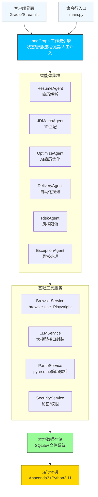
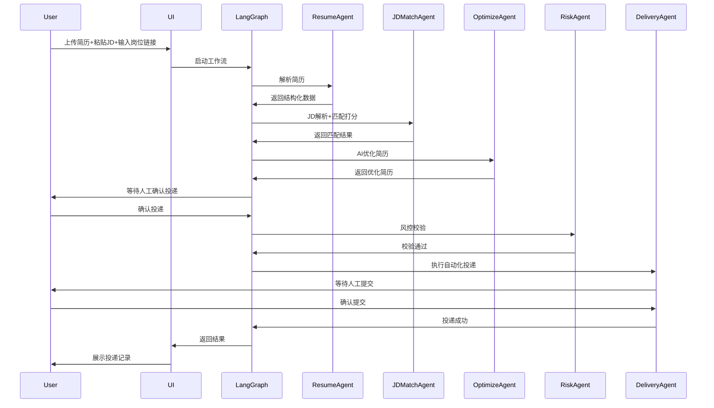

# AI求职多智能体助手（AI Job Agent）
## 详细技术设计文档 V1.0
**文档归属**：研发部
**适用阶段**：详细开发、代码实现、单元测试、集成测试
**技术栈**：Anaconda3 + Python 3.11 + LangGraph + Playwright/browser-use + SQLite
**核心定位**：企业级、模块化、可维护、高可用的AI求职自动化系统

---

## 1. 文档概述
### 1.1 文档目的
本文档为**AI求职多智能体助手**的详细技术实现方案，明确系统架构、模块设计、数据结构、核心流程、安全风控、异常处理、开发规范，为研发人员提供**可直接落地的编码指导**。

### 1.2 适用范围
覆盖系统所有技术模块：多智能体编排、浏览器自动化、简历解析、AI优化、数据存储、风控安全、异常处理。

### 1.3 术语与缩写
| 术语 | 含义 |
|------|------|
| LangGraph | 多智能体工作流编排框架（核心） |
| browser-use | AI浏览器自动化工具 |
| Agent | 智能体（单一业务执行单元） |
| State | LangGraph 全局共享状态 |
| JD | 岗位描述（Job Description） |
| SQLite | 本地轻量数据库 |
| MVP | 最小可行版本 |

### 1.4 参考资料
- LangGraph 官方文档
- browser-use / Playwright 官方文档
- 项目需求规格设计文档 V1.0
- Anaconda3 环境管理规范

---

## 2. 整体技术架构设计
### 2.1 架构设计原则
1. **模块化**：单一职责，低耦合高内聚
2. **流程化**：基于LangGraph状态机编排，可控可追踪
3. **安全优先**：本地存储、风控限流、人工兜底
4. **异常自愈**：自动处理验证码、登录失效、页面改版
5. **可扩展**：支持多平台、多模型、多功能迭代

### 2.2 分层架构图（企业级）


### 2.3 核心技术选型说明
| 模块 | 技术选型 | 选择理由 |
|------|----------|----------|
| 环境管理 | Anaconda3 | AI项目主流，隔离依赖，兼容大模型库 |
| 流程编排 | LangGraph | 支持状态持久化、人工介入、异常回退 |
| 浏览器自动化 | browser-use + Playwright | 开源成熟，处理验证码/页面改版 |
| 简历解析 | pyresume | 轻量PDF/DOCX解析，结构化输出 |
| 数据存储 | SQLite | 本地零配置，轻量，适合客户端 |
| 界面 | Gradio | 快速搭建可视化界面，无需前端开发 |
| 开发规范 | Pydantic + Ruff | 类型校验、代码格式化、企业级规范 |

---

## 3. 核心模块详细设计
### 3.1 LangGraph 工作流核心模块（编排中枢）
#### 3.1.1 全局状态定义（`app/workflow/state.py`）
```python
from typing import TypedDict, Optional, Dict, List
from pydantic import BaseModel

# 全局共享状态（所有智能体读写）
class JobAgentState(TypedDict):
    # 基础输入
    resume_path: str
    jd_text: str
    position_url: str
    user_confirm: bool  # 人工确认标识

    # 解析数据
    resume_struct: Optional[Dict]
    jd_struct: Optional[Dict]
    match_score: Optional[int]
    match_feedback: Optional[List[str]]

    # 优化数据
    optimized_resume: Optional[str]
    cover_letter: Optional[str]

    # 投递数据
    delivery_status: Optional[str]  # pending/success/failed/abort
    browser_session: Optional[Dict]

    # 异常数据
    error_code: Optional[str]
    error_msg: Optional[str]
    need_human_intervene: bool  # 人工介入标识
```

#### 3.1.2 工作流编排（`app/workflow/job_workflow.py`）
**流程**：简历解析 → JD匹配 → AI优化 → 人工确认 → 风控校验 → 自动化投递 → 结果记录
**分支**：异常/低匹配/风控触发 → 终止流程

### 3.2 简历管理模块（`app/agents/resume_agent.py`）
#### 3.2.1 核心功能
- PDF/DOCX简历上传、解析、结构化提取
- 本地简历版本管理
- 简历数据加密存储

#### 3.2.2 核心接口
```python
def parse_resume(state: JobAgentState) -> JobAgentState:
    """简历解析节点"""
    pass

def save_resume_version(state: JobAgentState) -> JobAgentState:
    """保存优化后简历"""
    pass
```

### 3.3 JD解析与匹配模块（`app/agents/jd_agent.py`）
#### 3.3.1 核心功能
- JD文本结构化提取（技能、年限、学历）
- 语义化匹配打分（0-100）
- 低匹配度拦截

#### 3.3.2 匹配规则
- 关键词匹配权重：60%
- 工作年限匹配权重：20%
- 学历匹配权重：20%

### 3.4 AI简历优化模块（`app/agents/optimize_agent.py`）
#### 3.4.1 核心功能
- 基于JD的关键词植入
- 工作成果量化优化
- 求职信生成

#### 3.4.2 依赖
- LLM大模型接口封装
- Pydantic 结果校验

### 3.5 自动化投递模块（`app/agents/delivery_agent.py`）
#### 3.5.1 核心功能
- 浏览器启动、会话管理
- 表单自动填充、简历上传
- 人工确认后提交投递

#### 3.5.2 依赖
- browser-use 浏览器控制
- Playwright 元素定位
- Cookie 本地加密存储

### 3.6 风控与限流模块（`app/agents/risk_agent.py`）
#### 3.6.1 核心功能
- 单日投递量控制
- 投递间隔随机延时
- 真人行为模拟（滚动、停留）
- 风控关键词检测

#### 3.6.2 风控参数（默认配置）
```python
MAX_DAILY_DELIVERY = 20    # 单日最大投递
MIN_DELAY = 2              # 最小延时
MAX_DELAY = 4              # 最大延时
DELIVERY_TIME_WINDOW = "09:00-18:00"  # 投递时段
MATCH_THRESHOLD = 70       # 最低匹配分数
```

### 3.7 异常处理模块（`app/agents/exception_agent.py`）
#### 3.7.1 核心功能
- 验证码检测与暂停
- 登录失效检测与重连
- 页面元素失效（改版）检测
- 全局异常捕获与日志记录

---

## 4. 数据存储设计（本地SQLite）
### 4.1 设计原则
- **纯本地存储**，无云端同步
- 简历/配置加密存储
- 轻量、零配置

### 4.2 数据库表结构
#### 1. 简历表（resume）
| 字段 | 类型 | 说明 |
|------|------|------|
| id | INTEGER | 主键 |
| file_path | TEXT | 简历路径 |
| file_type | TEXT | pdf/docx |
| struct_data | TEXT | 结构化数据（JSON） |
| create_time | TEXT | 创建时间 |

#### 2. 投递记录表（delivery_record）
| 字段 | 类型 | 说明 |
|------|------|------|
| id | INTEGER | 主键 |
| company | TEXT | 公司名 |
| position | TEXT | 岗位 |
| position_url | TEXT | 岗位链接 |
| match_score | INTEGER | 匹配分数 |
| status | TEXT | 投递状态 |
| create_time | TEXT | 时间 |

#### 3. 系统配置表（sys_config）
| 字段 | 类型 | 说明 |
|------|------|------|
| id | INTEGER | 主键 |
| config_key | TEXT | 配置键 |
| config_value | TEXT | 配置值 |

#### 4. 异常日志表（exception_log）
| 字段 | 类型 | 说明 |
|------|------|------|
| id | INTEGER | 主键 |
| error_code | TEXT | 异常码 |
| error_msg | TEXT | 异常信息 |
| screenshot_path | TEXT | 截图路径 |
| create_time | TEXT | 时间 |

---

## 5. 核心业务流程时序图
### 5.1 标准投递流程


---

## 6. 安全与风控技术设计
### 6.1 账号安全设计
1. **Cookie AES加密存储**，仅本地可读
2. 7天无操作自动清除登录状态
3. 禁止保存账号密码，仅支持扫码登录

### 6.2 行为风控设计
1. **随机延时**：2-4秒投递间隔
2. **时段限制**：仅9:00-18:00允许投递
3. **单日上限**：最大20次投递
4. **真人模拟**：页面滚动、鼠标停留、输入延迟

### 6.3 数据安全设计
1. 所有隐私数据**本地存储**，不上传云端
2. 简历文件加密存储
3. 一键清空所有数据功能
4. `.env` 配置文件不上传Git

---

## 7. 异常处理设计
### 7.1 全局异常处理机制
- 统一异常基类：`JobAgentException`
- 异常分级：警告、错误、致命错误
- 异常自动截图、本地日志记录

### 7.2 核心异常处理流程
1. **验证码异常**
   检测到滑块/图文验证码 → 暂停流程 → 展示截图 → 用户输入 → 恢复流程
2. **登录失效异常**
   检测到登录过期 → 暂停流程 → 引导扫码登录 → 断点续投
3. **页面改版异常**
   元素定位失败 → 终止自动投递 → 引导手动投递
4. **风控触发异常**
   检测到账号异常 → 立即暂停 → 给出申诉指引

---

## 8. 开发环境规范
### 8.1 环境要求
- 系统：Windows 10+ / macOS 12+
- 环境管理：**Anaconda3**
- Python 版本：3.11

### 8.2 环境搭建命令
```bash
# 创建虚拟环境
conda create -n ai_job_agent python=3.11
conda activate ai_job_agent

# 安装依赖
pip install -r requirements.txt
playwright install chrome
```

### 8.3 企业级项目目录结构
```
ai-job-agent-platform/
├── .env                      # 本地配置（不上传）
├── .env.example              # 配置模板
├── .gitignore                # Git忽略文件
├── requirements.txt          # 依赖清单
├── main.py                   # 项目入口
├── app/
│   ├── __init__.py
│   ├── core/                 # 核心配置/异常
│   ├── agents/               # 智能体模块
│   ├── workflow/              # LangGraph编排
│   ├── utils/                 # 工具类
│   └── db/                    # 数据库操作
├── tests/                    # 单元测试
└── logs/                     # 日志目录
```

---

## 9. 部署与打包方案
### 9.1 部署模式
**本地客户端模式**（无服务端，纯桌面应用）

### 9.2 打包工具
PyInstaller 打包为 exe（Windows）/ app（macOS）

### 9.3 打包命令
```bash
pyinstaller -w -i logo.ico main.py --name AI求职管家
```

---

## 10. 测试方案
### 10.1 单元测试
- 测试框架：pytest
- 测试范围：智能体函数、工具类、数据库操作

### 10.2 集成测试
- 流程：简历解析 → 匹配 → 优化 → 投递 全流程
- 用例：正常流程、异常流程、风控触发流程

### 10.3 场景测试
1. 验证码出现场景
2. 登录失效场景
3. 页面改版场景
4. 低匹配度拦截场景

---

## 11. 编码规范（企业级）
1. **类型注解**：所有函数/类必须添加类型注解
2. **代码格式化**：使用 Ruff 格式化
3. **日志规范**：统一使用 logging 模块
4. **异常捕获**：禁止裸 except，必须捕获具体异常
5. **配置规范**：所有配置从 `.env` 读取，禁止硬编码

---

## 12. 文档版本管理
| 版本 | 日期 | 修订人 | 修订内容 |
|------|------|--------|----------|
| V1.0 | 2026-04-03 | 研发部 | 初始详细技术设计文档 |

---

## 13. 附录
### 13.1 核心依赖清单
```txt
langgraph>=0.3.0
langchain>=0.2.0
playwright>=1.40.0
browser-use>=0.1.0
pyresume>=0.1.0
python-dotenv>=1.0.0
pydantic>=2.0.0
ruff>=0.1.0
pytest>=7.0.0
sqlite3
gradio>=4.0.0
```

### 13.2 异常码定义
| 异常码 | 含义 |
|--------|------|
| E001 | 简历解析失败 |
| E002 | JD匹配失败 |
| E003 | 验证码触发 |
| E004 | 登录失效 |
| E005 | 页面元素失效 |
| E006 | 风控触发 |
| E007 | 投递超时 |